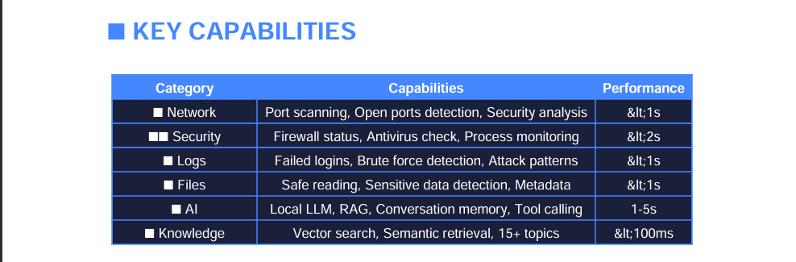
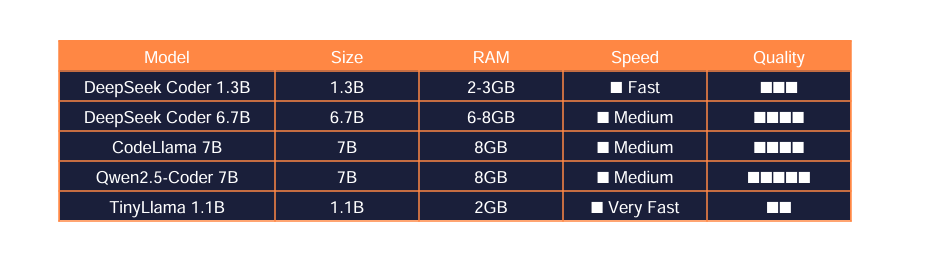
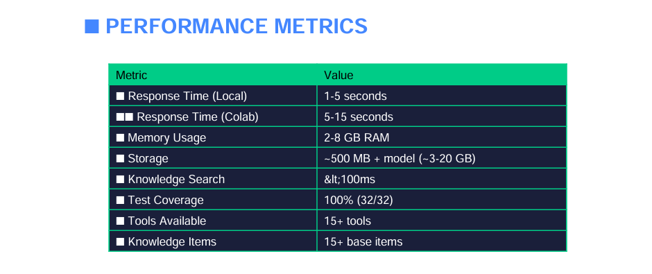
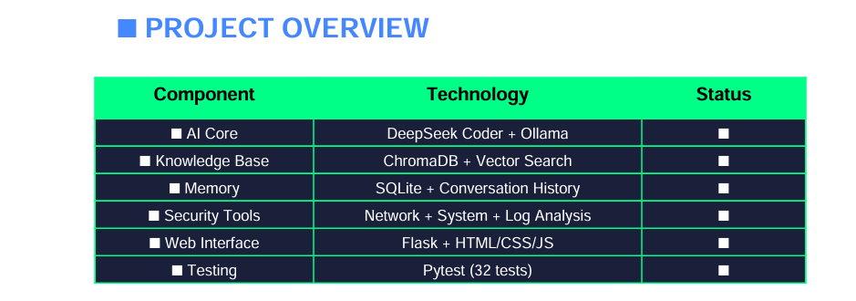

# Kamuna AI 

> **An intelligent AI-powered Cyber Security Assistant with local LLM, knowledge base, and security tools.**

---

## **Project Overview & Capabilities**

## License

MIT License - Free for educational and commercial use.

## Acknowledgments

[Ollama](https://ollama.com/) - Local LLM runtime

[Deepseek](https://www.deepseek.com/) - Code-specialized models

[ChromaDB](https://docs.trychroma.com/) - Vector database

## Contact
 
[GitHub](neondevlopers/kamuna-ai) 

[Issues](https://github.com/neondevlopers/kamuna-ai/issues) 

LangChain - LLM framework

